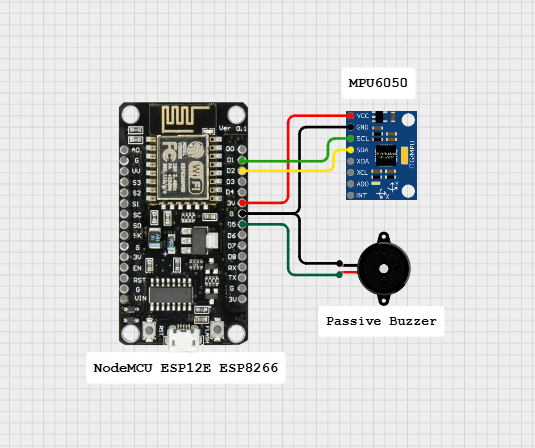

# DIY Earthquake Alert System

A DIY **Earthquake Alert System** built with the ESP8266 (NodeMCU / Wemos D1 Mini) and an MPU6050 3-axis accelerometer + gyroscope module.  
The system continuously monitors vibrations, filters noise, and activates both an audible and visual alarm (buzzer + LED) when significant shaking is detected.

---

## 🎥 Video Demonstration

Watch the live demo here:  
[👉 Video Demonstration](https://vt.tiktok.com/ZSUXM96RY/)  

---

## Hardware Requirements

- ESP8266 development board (NodeMCU, Wemos D1 Mini, etc.)  
- MPU6050 accelerometer + gyroscope sensor  
- Passive buzzer  
- Onboard LED (GPIO2 / D4, active LOW)  
- Jumper wires, breadboard, stable 3.3 V power supply  
- *(Optional)* 18650 battery + solar charging module + solar panel  

---

## Pinout & Wiring

| ESP8266 Pin | Function / Signal | Destination           |
|-------------|------------------|-----------------------|
| 3V3         | Power VCC        | MPU6050 VCC           |
| GND         | Ground           | MPU6050 GND           |
| D1 (GPIO5)  | I²C SCL          | MPU6050 SCL           |
| D2 (GPIO4)  | I²C SDA          | MPU6050 SDA           |
| D5 (GPIO14) | Buzzer +         | Passive Buzzer (+)    |
| GND         | Buzzer −         | Passive Buzzer (−)    |
| D4 (GPIO2)  | Onboard LED      | Active LOW indicator  |

---

## Schematic Diagrams

**Basic Setup:**  

**Solar-Powered Version:**
- **Optional solar-powered version** for backup during power outages    

Notes:  
- The onboard LED is tied to **GPIO2 (D4)** on most ESP8266 boards.  
- Use a **passive buzzer** (not active).  
- The MPU6050 requires a clean and stable **3.3 V supply**.  

---

## 📜 License

This project is licensed under the **MIT License**.  
See the [LICENSE](LICENSE) file for details.

---

## 👤 Author

Created with passion by **Roy Cuadra**  
