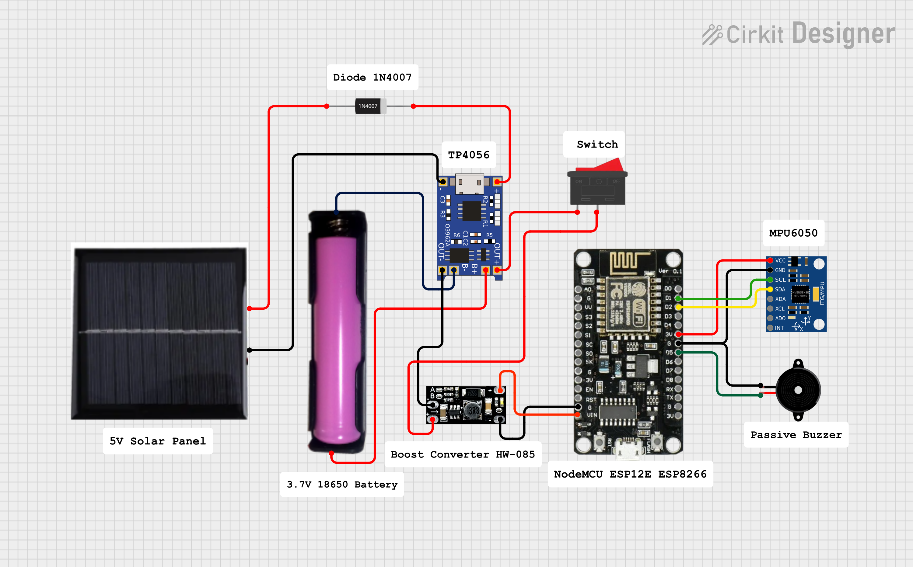

# DIY Earthquake Alert System

A DIY **Earthquake Alert System** built with the ESP8266 (NodeMCU / Wemos D1 Mini) and an MPU6050 3-axis accelerometer + gyroscope module.  
The system continuously monitors vibrations, filters noise, and activates both an audible and visual alarm (buzzer + LED) when significant shaking is detected.

---

## Video Demonstration

Watch the live demo here:  
[ Video Demonstration](https://vt.tiktok.com/ZSUXM96RY/)  

---

## Hardware Requirements

- ESP8266 development board (NodeMCU, Wemos D1 Mini, etc.)  
- MPU6050 accelerometer + gyroscope sensor  
- Passive buzzer  
- Onboard LED (GPIO2 / D4, active LOW)  
- Jumper wires, breadboard, stable 3.3 V power supply  
- *(Optional)* 18650 battery + solar charging module + solar panel  

---

## Pinout & Wiring

| ESP8266 Pin | Function / Signal | Destination           |
|-------------|------------------|-----------------------|
| 3V3         | Power VCC        | MPU6050 VCC           |
| GND         | Ground           | MPU6050 GND           |
| D1 (GPIO5)  | I²C SCL          | MPU6050 SCL           |
| D2 (GPIO4)  | I²C SDA          | MPU6050 SDA           |
| D5 (GPIO14) | Buzzer +         | Passive Buzzer (+)    |
| GND         | Buzzer −         | Passive Buzzer (−)    |
| D4 (GPIO2)  | Onboard LED      | Active LOW indicator  |

---

## Schematic Diagrams

**Basic Setup:**  

**Solar-Powered Version:**
- **Optional solar-powered version** for backup during power outages    

---

## Setup & Instructions

### 1. Install Arduino IDE
- Download and install the latest [Arduino IDE](https://www.arduino.cc/en/software).

### 2. Add ESP8266 Board Package
1. Open Arduino IDE  
2. Go to **File → Preferences**  
3. In **Additional Board Manager URLs**, add:
> http://arduino.esp8266.com/stable/package_esp8266com_index.json  
4. Go to **Tools → Board → Board Manager**, search for **ESP8266**, and install.

### 3. Install Required Libraries
In Arduino IDE, go to **Sketch → Include Library → Manage Libraries...** and install:
- **Wire** (usually pre-installed)  
- **MPU6050** by Electronic Cats / Jeff Rowberg (I²Cdevlib)  

### 4. Select Your Board & Port
- Go to **Tools → Board**, select your ESP8266 (e.g., NodeMCU 1.0 / Wemos D1 Mini).  
- Select the correct **COM Port** under **Tools → Port**.  

### 5. Upload the Code
1. Open the provided `.ino` code file in Arduino IDE.  
2. Click the **Upload** button (right arrow icon).  
3. Wait until the code compiles and uploads successfully.  

### 6. Test the System
- Once uploaded, open the **Serial Monitor** at **115200 baud**.  
- The system will calibrate automatically, then start monitoring vibrations.  
- Shake the sensor slightly to trigger the buzzer + LED.  

---

## License

This project is licensed under the **MIT License**.  
See the [LICENSE](LICENSE) file for details.

---

## Author

Created with passion ❤ by **Roy Cuadra** 
Date: 10/18/2025 
